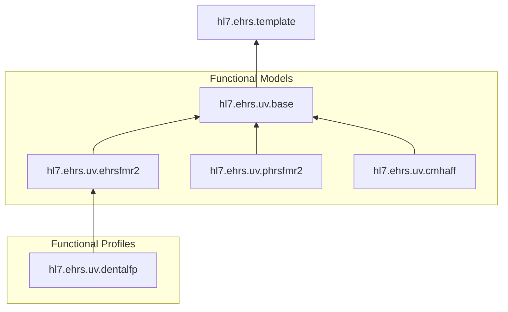

This IG will be the basis for all EHRS-Family of IGs, the Functional Models and Functional Profiles.

### Way of Working

explain ...
- edit the FM/FP using the FM/FP spreadsheet template
    - run the ehrsfm tool to generate the max file from the spreadsheet
- create an IG and run the max2fhir script
    - optionally add satisfiedBy
- use ehr-s fm template
- add examples
- add test cases for validation

#### Diagram

### Structure for each FM/FP IG 

input/...
script/
    max2fhir.js (transforms the max version of the fm/fp to FHIR IG artifacts and also uses satisfiedBy.txt)
    max2plantuml.js
    ig-template.json
source/
    overview document
    fm-max (generated by ehrs-tool script from spreadsheet)
    satisfiedBy.txt (and ods or xslx source)

### Previously Hidden Content

* Examples - some examples were not rendered; now part of Section, Header and Function description
* Actors - added to Section rendering
* Conditional and Dependent flags - prepended italic to conformance

### New Content - SatisfiedBy

As a preview to EHR-S FM R3 we can populated the satisfiedBy for functions with a reference to the associated FHIR Resource or FHIR Profile.
This is driven by the source/satisfiedBy.txt file that is used by the max2fhir script.
