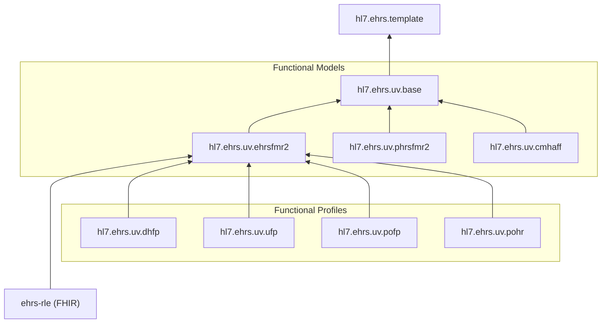

This IG will be the base of all EHRS-Family of IGs, the Functional Models and Functional Profiles.

### Way of Working

explain ...
- edit the FM/FP using the FM/FP spreadsheet template
    - run the ehrsfm tool to generate the max file from the spreadsheet
- create an IG and run the max2fhir script
    - optionally add satisfiedBy
- use ehr-s fm template
- add examples
- add test cases for validation

#### FHIR IG Package Relationships

### Structure for each FM/FP IG 

input/...
script/
    max2fhir.js (transforms the max version of the fm/fp to FHIR IG artifacts and also uses satisfiedBy.txt)
    max2plantuml.js
    ig-template.json
source/
    overview document
    fm-max (generated by ehrs-tool script from spreadsheet)
    satisfiedBy.txt (and ods or xslx source)

### Generic content from EHR-S FM for all Functional Models/Profiles

- [chapter1](scope.html) - Scope - rewriten to "a" instead of "the"
- chapter3 - Terms and Definitions
- chapter6 - Conformance Clause
- chapter7 - EHR System Conformance Claim via Self-Attestation
- chapter8 - Glossary

### Status

Status ISO Normative / Reference vs FHIR Normative / Informative

See [EHR-S Functional Model Scope - Table 1](scope.html#ehr-s-functional-model-scope)

### Function List Component Descriptions

The Function List (see [artifacts](artifacts.html)) includes the following components:

| FM Element | Requirements element | Description |
| --- | --- | --- |
| Function ID # <a href="https://hl7.org/fhir/versions.html#std-process" title="Normative Content" class="normative-flag">N</a> | [id](https://hl7.org/fhir/R5/requirements-definitions.html#Requirements.id) | This is the unique identifier of a function in the Function List (e.g. CP.1.1) and should be used to uniquely identify the function when referencing functions. The Function ID also serves to identify the section within which the function exists (CP = Care Provision Section) and the hierarchy or relationship between functions (CP.1.1 is a sibling to CP.1.2, parent of CP.1.1.1 and child of CP.1). In many cases the parent is fully expressed by the children. |
| Function Type <a href="https://hl7.org/fhir/versions.html#std-process" title="Informative Content" class="informative-flag">I</a> | [meta.profile](https://hl7.org/fhir/R5/requirements-definitions.html#Requirements.meta.profile) | Indication of the line item as being a header (H) or function (F) or conformance criteria. |
| Header / Function Name <a href="https://hl7.org/fhir/versions.html#std-process" title="Normative Content" class="normative-flag">N</a> | [title](https://hl7.org/fhir/R5/requirements-definitions.html#Requirements.title)  | This is the name of the Function and whilst expected to be unique within the Function List; it is not recommended to be used to identify the function without being accompanied by the Function ID. Example: Manage Medication List |
| Function Statement <a href="https://hl7.org/fhir/versions.html#std-process" title="Normative Content" class="normative-flag">N</a> | [description](https://hl7.org/fhir/R5/requirements-definitions.html#Requirements.description) | This is a brief statement of the purpose of this function. Whist not restricted to the use of structured language that is used in the Conformance Criteria (see below); the Statement should clearly identify the purpose and scope of the function. Example: Create and maintain patient-specific medication lists.|
| Description <a href="https://hl7.org/fhir/versions.html#std-process" title="Informative Content" class="informative-flag">I</a> | [purpose](https://hl7.org/fhir/R5/requirements-definitions.html#Requirements.purpose) | This is a more detailed description of the function, including examples if needed. Example: Medication  lists are managed over time, whether over the course of a visit or stay, or the lifetime of a patient. All pertinent dates, including medication start, modification, and end dates are stored. The entire medication history for any medication, including alternative supplements and herbal medications, is viewable. Medication lists are not limited to medication orders recorded by providers, but may include, for example, pharmacy dispense/supply records, patient-reported medications and additional information such as age specific dosage. |
| Conformance Criteria <a href="https://hl7.org/fhir/versions.html#std-process" title="Normative Content" class="normative-flag">N</a> | [statement.requirement](https://hl7.org/fhir/R5/requirements-definitions.html#Requirements.statement.requirement)  | Each function in the Function List includes one or more Conformance Criteria. A Conformance Criteria, which exists as normative language in this standard, defines the requirements for conforming to the function. The language used to express a conformance criterion is highly structured with standardized components with set meanings. The structured language used to define conformance clauses in the Function List are defined in the Glossary (Chapter 4).
| R1.1 Reference <a href="https://hl7.org/fhir/versions.html#std-process" title="Informative Content" class="informative-flag">I</a> | [statement.derivedFrom](https://hl7.org/fhir/R5/requirements-definitions.html#Requirements.statement.derivedFrom) | Reference to the previous version of the Functional Model is included to support transition from one version to the next. The first 2 digits indicate the source document; FM = Functional Model, LM = Lifecycle Model. The remainder of the reference is to the function and, if applicable, conformance criteria.
| **New Content** Satisfied By | [statement.satisfiedBy](https://hl7.org/fhir/R5/requirements-definitions.html#Requirements.statement.satisfiedBy) | As a preview to EHR-S FM R3 we can populated the satisfiedBy for functions with a reference to the associated FHIR Resource or FHIR Profile. This is driven by the source/satisfiedBy.txt file that is used by the max2fhir script.
| Change Indicator | [Extension](StructureDefinition-requirements-change-info.html) | The change indicator shows the change from previous versions. This will be valued as follows:  C - Changed D - Deleted N - New NC - No Change |

#### Previously Hidden Content

* Examples - some examples were not rendered; now part of Section, Header and Function description
* Actors - added to Section rendering
* Conditional and Dependent flags - prepended italic to conformance

### EHR WG CoChairs and Publishing Facilitators

| Role  | Name | Organization | Contact |
| --- | --- | --- | --- |
| **Co-Chair** | Gary Dickinson | EHR Standards Consulting | gary.dickinson@ehr-standards.com |
| **Co-Chair** | Mark Janczewski MD, MPH | Medical Networks, LLC | mark.janczewski@gmail.com |
| **Co-Chair** | Michael Brody DPM | Registry Clearinghouse | mbrody@registryclearinghouse.net |
| **Co-Chair** | John Ritter FHL7, MSc |  | johnritter1@verizon.net |
| **Co-Chair** | Lincoln Weed |  | ldweed424@gmail.com |
| **Co-Chair, Publishing Facilitator** | Michael van der Zel BSc | UMCG | m.van.der.zel@umcg.nl |
